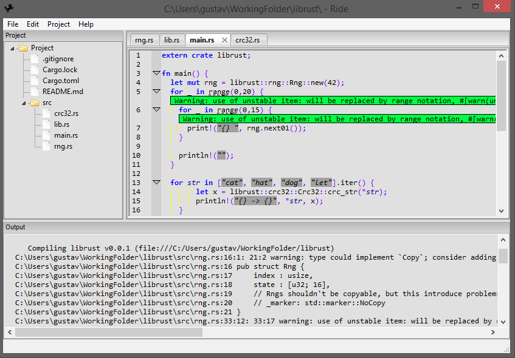
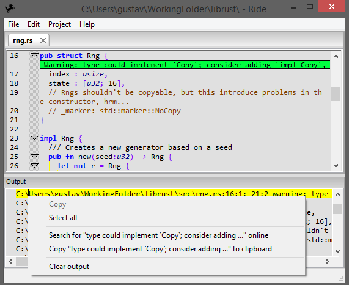

This branch contains the development of a "new ride" that maintain a small impact on the ui library. This is for a few reasons.

* Can customize the colors of the whole ui instead of what the os thinks a list should look like
* Can more easily switch to another ui library if the current one has issues

I'd like to rewrite a revision 2 in rust (rust branch) but can't seem to find a good ui library that lets me create a window and just draw text, rectangles, lines and respond to various events. Currently thinking about creating a small FFI wxWidgets based library that does just that.

In the mean time I still think ride classic (classic branch) is useable but far from good or recomended for any serious rust development.

Ride is a general text editor like vs code, the name comes from concatenating R from [Rust](http://www.rust-lang.org/) and [IDE](https://en.wikipedia.org/wiki/Integrated_development_environment), but that has lost it's meaning, now it's just a name. It's currently not in a usable state.
If you're looking for something more complete, perhaps [RustDT](http://rustdt.github.io/) for Eclipse, [SolidOak](https://github.com/oakes/SolidOak) or [Rust](https://github.com/rrandom/Brackets-Rust-IDE/) for [brackets](http://brackets.io/) is your thing.

# Screenshots

# Getting ride
This isn't finished. Eventually there should be a installer here, but that isn't finished. [Issue #13](https://github.com/madeso/ride/issues/13) is looking to fix this. If you want to try it, you need to download the source and build it yourself.

Since it isn't finished at first launch you might want to set all the colors to something other than black. [Issue 64](https://github.com/madeso/ride/issues/64) should fix this.

# Building ride
You need CMake, a C++ compiler and wxWidgets 3+. To actually build it, it is pretty standard. Use CMake to generate a configuration and then build that configuration.
