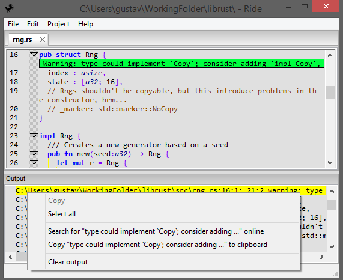

This project is currently unmaintained. I'd like to rewrite a revision 2 in rust (rust branch) but can't seem to find a good ui library that lets me create a window and just draw text, rectangles, lines and respond to various events. Currently thinking about creating a small FFI wxWidgets based library that does just that.

In the mean time I still think ride c++ is useable but far from good or recomended for any serious rust development.

Ride is a [Rust](http://www.rust-lang.org/) [IDE](https://en.wikipedia.org/wiki/Integrated_development_environment). It's named after concatenating R from rust and IDE. It's currently not in a usable state.
If you're looking for something more complete, perhaps [RustDT](http://rustdt.github.io/) for Eclipse, [SolidOak](https://github.com/oakes/SolidOak) or [Rust](https://github.com/rrandom/Brackets-Rust-IDE/) for [brackets](http://brackets.io/) is your thing.

The current features are:

* A pretty ok editor (scintilla based)
* Shortcuts for running various cargo commands
* Listing its output and
	- Double clicking on warnings/errors to go to them.
	- Context clicking on warnings/errors to google them.
* A basic project/cargo (file) explorer
* Space/tab settings are saved per project so the same settings are used by everyone on the project
* Autocompile protobuf files

The project aim is to implement as much of it in C++ and then port it to rust when wxWidgets for rust is available.

Some of the development is streamed [on twitch](http://www.twitch.tv/imadesome) and later uploaded [to youtube](https://www.youtube.com/playlist?list=PLLZf3o2GDQ_hHiXd_xqL_ShzGcU44WMi3).

# Screenshots

# Getting ride
This isn't finished. Eventually there should be a installer here, but that isn't finished. [Issue #13](https://github.com/madeso/ride/issues/13) is looking to fix this. If you want to try it, you need to download the source and build it yourself.

Since it isn't finished at first launch you might want to set all the colors to something other than black. [Issue 64](https://github.com/madeso/ride/issues/64) should fix this.

# Building ride
You need CMake, a C++ compiler, protobuf and wxWidgets 3+. Doxygen, Python 2, clang-format and cppcheck are optional and can be disabled via the CMake BUILD_USE_ variables. To actually build it, it is pretty standard. Use CMake to generate a configuration and then build that configuration.

## wxWidgets 3.x
Currently the wxWidgets used is a fork from the public wxWidgets master. [Issue #16](https://github.com/madeso/ride/issues/16) is looking to fix this. The public download of wxWidgets 3.0 or the public master can be used but then the CMake variables USE_CPP_AS_RUST use WX_WIDGETS_LEGACY_FINDTEXT has to be changed to true.

# Contributing
I accept pull requests. Follow the google C++ style guide when writing new code.
