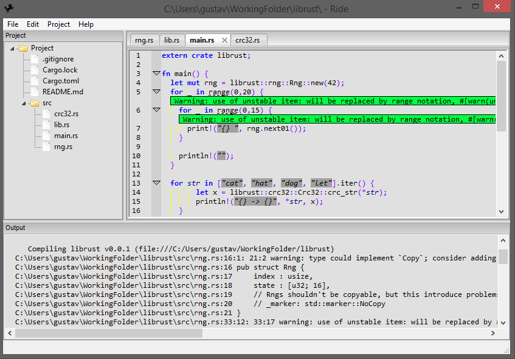

Ride is a [Rust](http://www.rust-lang.org/) [IDE](https://en.wikipedia.org/wiki/Integrated_development_environment). It's named after concatenating R from rust and IDE. It's currently not in a usable state.
If you're looking for something more complete, perhaps [RustDT](http://rustdt.github.io/) for Eclipse or [SolidOak](https://github.com/oakes/SolidOak) is your thing.

The current features are:

* A pretty ok editor (scintilla based)
* Shortcuts for running various cargo commands
* Listing its output and
	- Double clicking on warnings/errors to go to them.
	- Context clicking on warnings/errors to google them.
* A basic project/cargo (file) explorer

The project aim is to implement as much of it in C++ and then port it to rust when rust is released.

Most of the development is streamed [on twitch](http://www.twitch.tv/imadesome) and later uploaded [to youtube](https://www.youtube.com/playlist?list=PLLZf3o2GDQ_hHiXd_xqL_ShzGcU44WMi3).

# Features needed for a useful state

* Find in files, find in solution, incremental search, other searches
* Project file so we can open project with File->Open
* Have space/tab settings per project so the same settings are used by everyone on the project
* Implement all missing event handlers.
* Close project
* Reformat code

# Somewhat sorted roadmap

* Paste selection to http://lightpaste.com/ or http://hastebin.com/
* Sync file structure instead of reloading in project explorer
* Comment / uncomment selection
* Quick fix for compiler error: "error: unresolved name `hellos`. Did you mean `hello`?"
* Error list
* Go to next error shortcut
* Expose all aui settings in gui + settings
* Fix syntax scintilla syntax highlighting
	- wxWidgets [doesn't support](http://trac.wxwidgets.org/ticket/16776)  rust yet, perhaps temporarily solve it with conditional compilation with a cpp lexer and rust keywords
* Add println! format! argument highlighting
* Add configurable shortcuts
* Cpack support (=installer for ride)
* Intellisense/autocomplete support via [racer](https://github.com/phildawes/racer)
* Goto definition & goto definition of type
* Code snippets
* Implement ctrl+tab like visual studio to switch between open documents
* Start page
* Option to force charset, lineending and ending with newline when saving
* Sort selected lines
* Align/remove space left/right
* Trim left/right/both selected lines
* Mark important "word" for highlighting
* Switch between documentation and code for current file (auto generated, visible on command or if marked in the editor by a comment?)
* Editors for different files such as gui, bitmaps, FSMs.
* Change the color dialog button/control to a more photshop looking color dialog that sends the color directly to all the edits for instant feedback
* Highlight misspelled words/comments
* Function for selecting current word
* Implement smarter file template with [handlebars-rust](https://github.com/sunng87/handlebars-rust/tree/master)
* "aPRESS_ENTER_HEREb" should be replaced by concat!("a", NEW_LINE_HERE"CURSOR_HEREb")
* Switch tabs by scrolling with cursor over tab-bar
* Format file/selection
* Color member variables, local variables and member variables different.
* Startup options (open homepage, load last loaded project, show open project dialog box, show new project dialog box, show empty enviroment, show start page)
* Visual studio like debug settings
* Context menu support
* Simple/basic git commit shortcut with specifying the commit message
* Investigate debugging support (gdb? https://bjbell.wordpress.com/2015/02/17/emacs-rust-debugging/ )
* Custom styles (like zenburn, obsidian, ...)
* Import styles from other editors (like visualstudio / https://studiostyl.es/ )
* View documents inline instead of in a new tab
* File templates
* Numbered bookmarks
* Built in syntax highlight for shading languges like glsl like http://nshader.codeplex.com/
* Algorithm [debug/developing design](https://vimeo.com/36579366) by bret victor

# Debug ideas

- Color tint IDE depending on current thread executing?
- Add note to code (when debugging) to comeback to later

# Current wxWidgets modifications:

wxStyledTextCtrl::FindText modification:

Added findEnd argument and removed default argument

int FindText(int minPos, int maxPos, const wxString& text, int* findEnd, int flags);

Storing the match end index in the output pointer:

		int ret = SendMsg(2150, flags, (sptr_t)&ft);
		if (ret > 0 && findEnd) *findEnd = ft.chrgText.cpMax;
		return ret;
