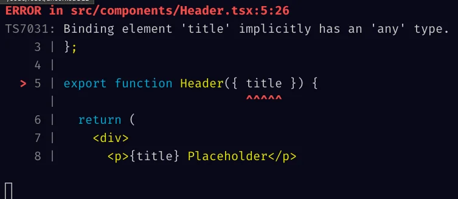

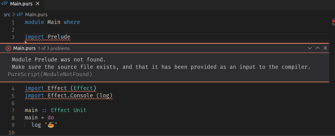

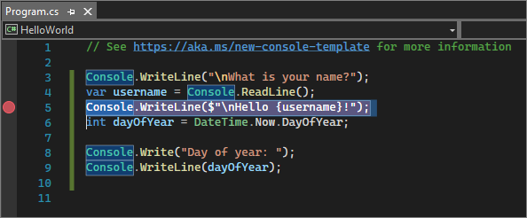

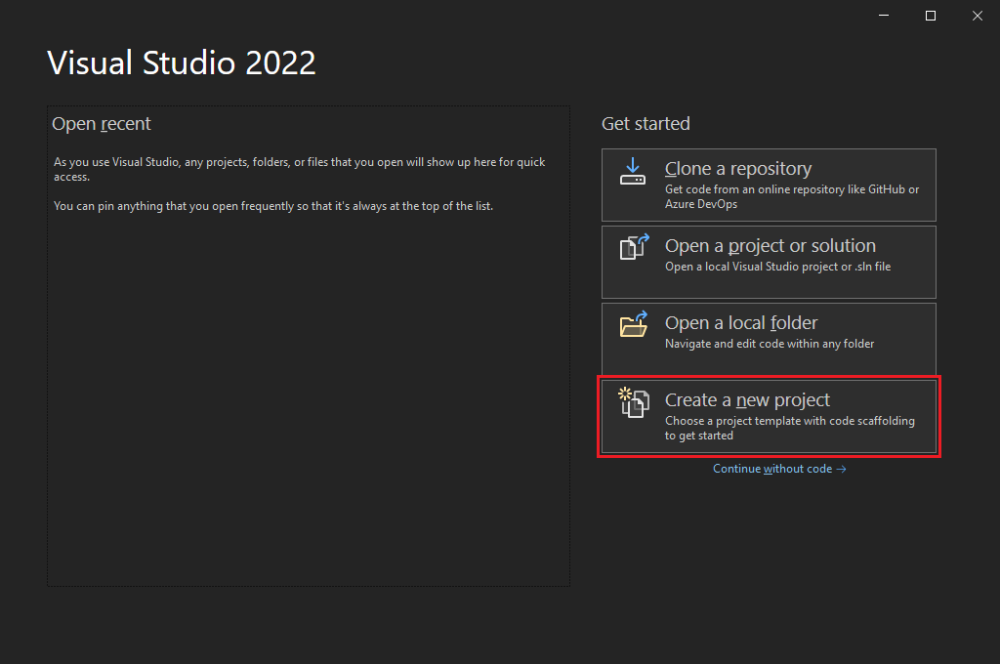

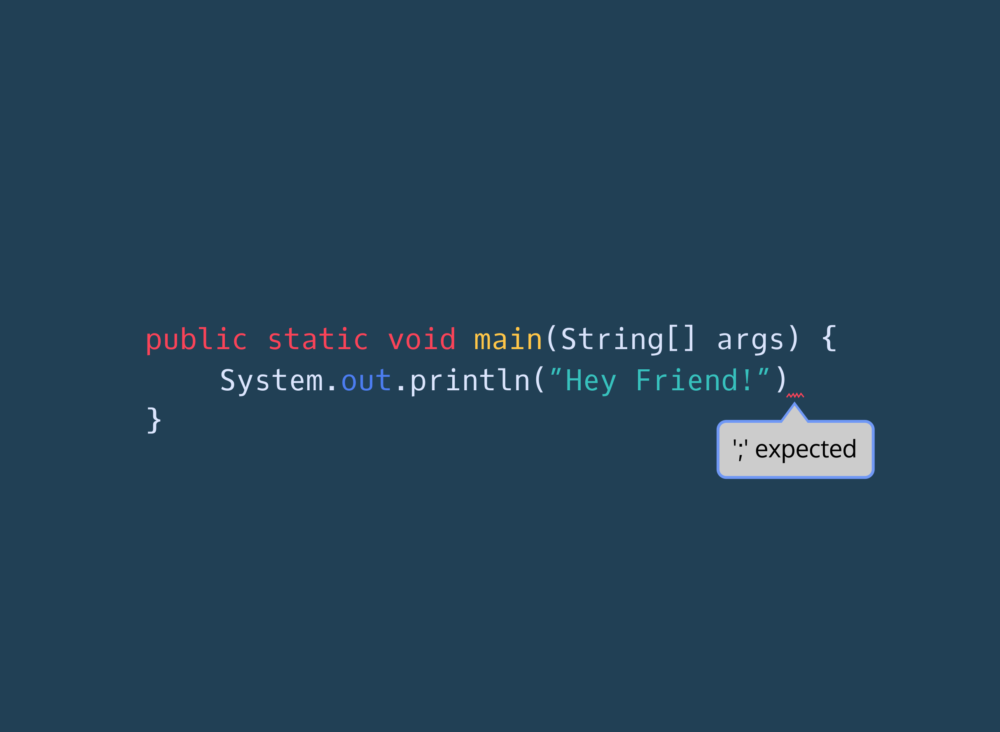

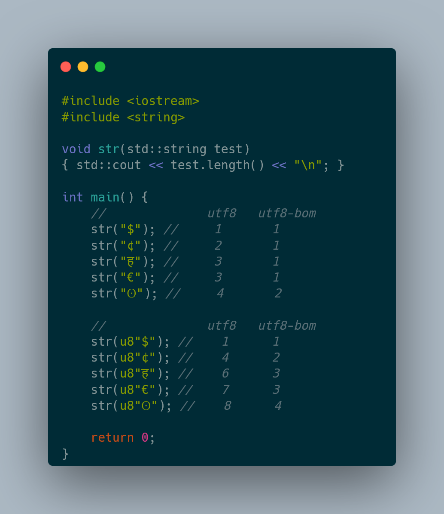

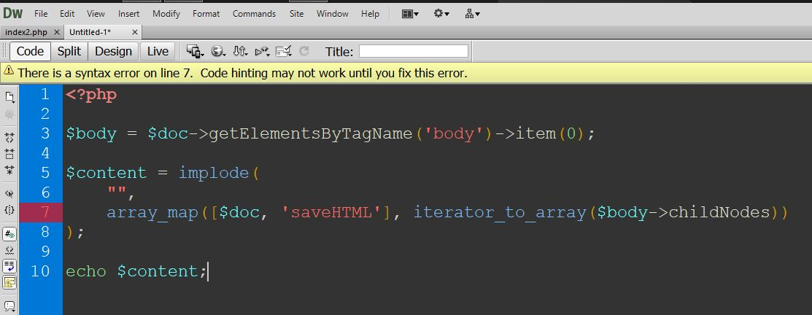

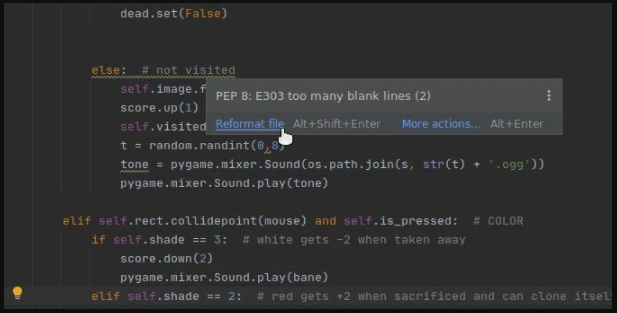

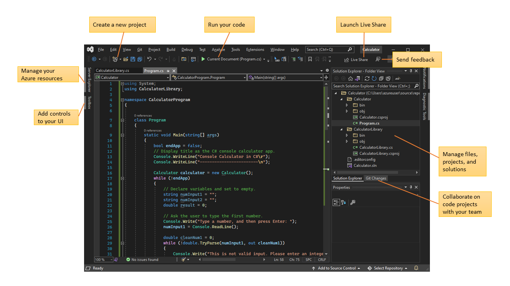

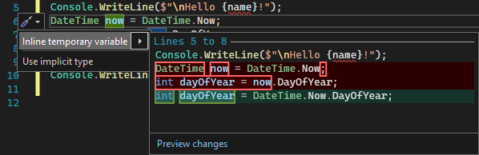

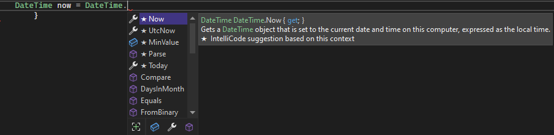

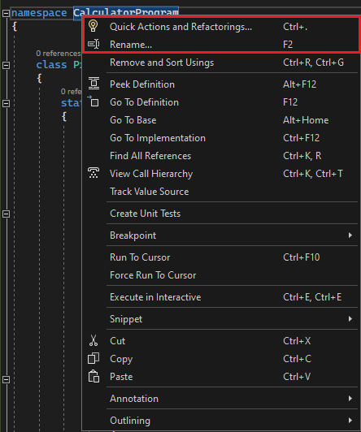

### edit - autocomplete, error list, doc view, explorer

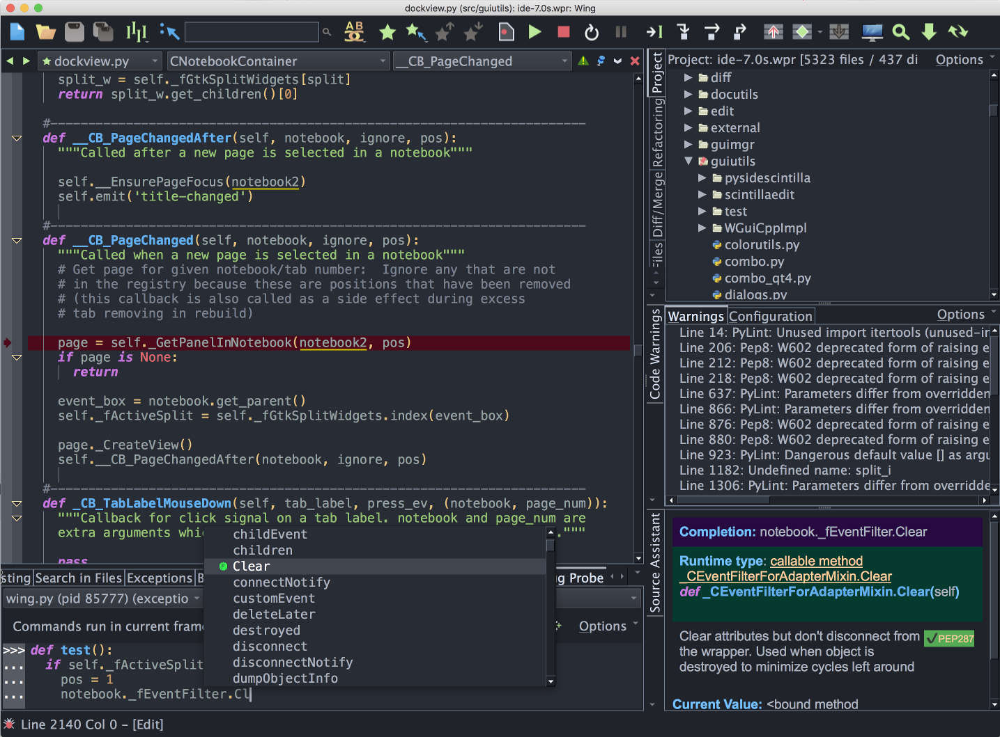

### app/edit - autocomplete

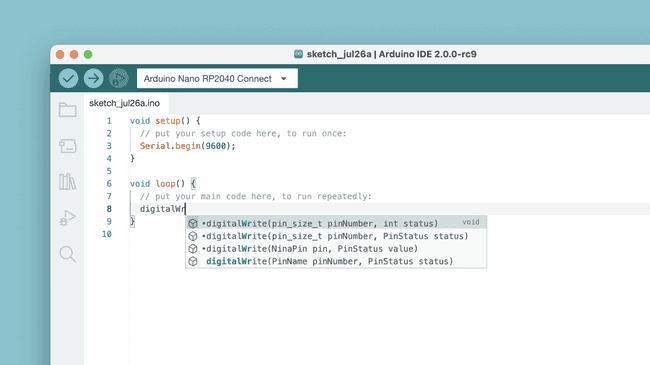

### app/sidebar: add plguin

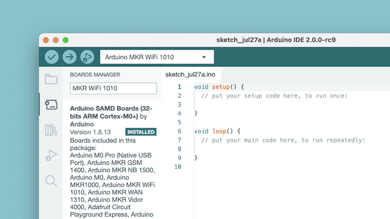

### app/edit: error squiggles/underline

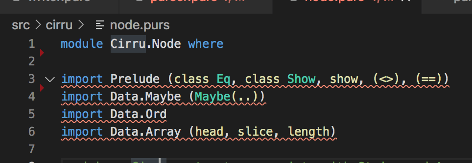

### edit - error popup on squiggles

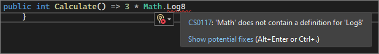

### Edit - compiler error list

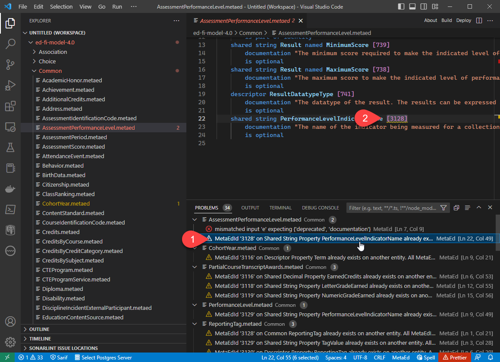

### app - global error message

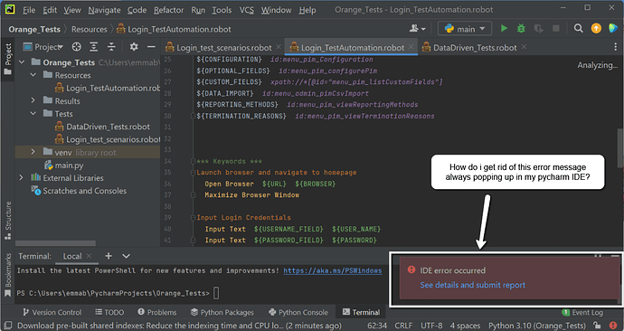

### debug - hover var quickview

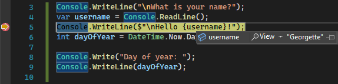

### app - overview

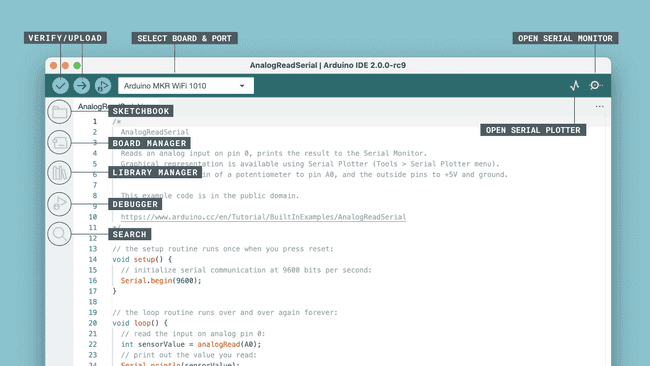

### command list keybind-gui

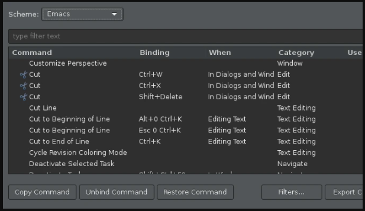

### Edit - decorations

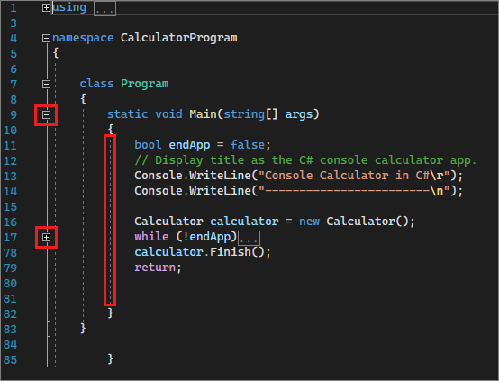

### Edit - Quick actions

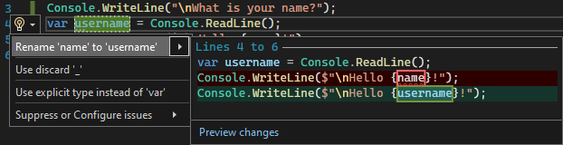

### app - start new project

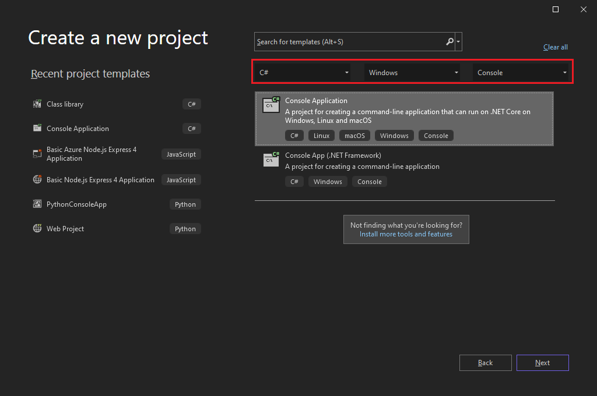

