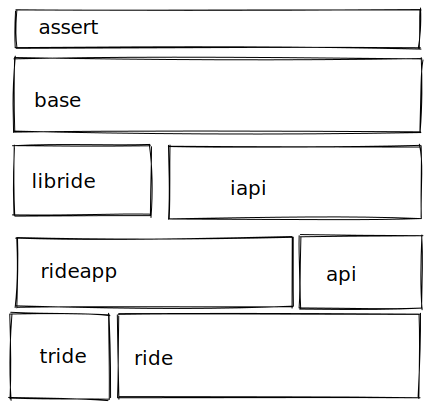

This branch contains the development of a "new ride" that maintain a small impact on the ui library. This is for a few reasons.

* Can customize the colors of the whole ui instead of what the os thinks a list should look like
* Can more easily switch to another ui library if the current one has issues

In the mean time I still think ride classic (classic branch) is useable but far from good or recomended for any serious rust development.

Ride is a general text editor like vs code, the name comes from concatenating R from [Rust](http://www.rust-lang.org/) and [IDE](https://en.wikipedia.org/wiki/Integrated_development_environment), but that has lost it's meaning, now it's just a name. It's currently not in a usable state.
If you're looking for something more complete, perhaps [RustDT](http://rustdt.github.io/) for Eclipse, [SolidOak](https://github.com/oakes/SolidOak) or [Rust](https://github.com/rrandom/Brackets-Rust-IDE/) for [brackets](http://brackets.io/) is your thing.

# Code layout

